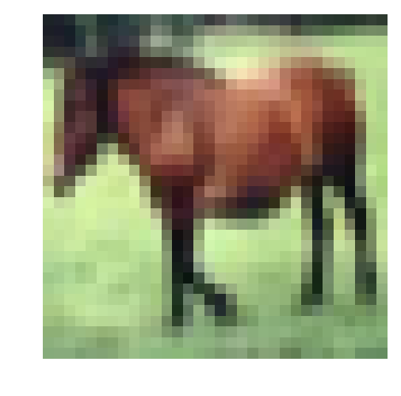
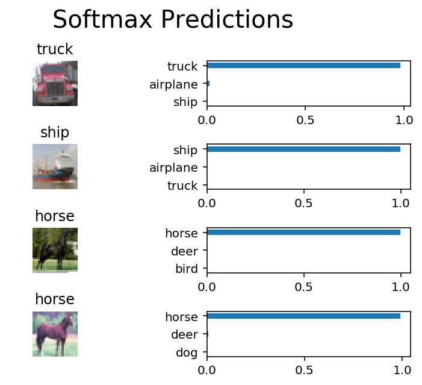

# 图片分类 （Image Classification）

此项目的目标是对[CIFAR-10](https://www.cs.toronto.edu/~kriz/cifar.html) 中的图片进行分类。该数据集包含飞机、猫、狗和其他物体。导入数据后，首先对这些图片进行预处理，然后基于所有样本训练一个卷积神经网络。图片进行标准化（normalized），标签需要采用 one-hot 编码。

## 1. 获取数据

运行以下单元，以下载 [CIFAR-10](https://www.cs.toronto.edu/~kriz/cifar-10-python.tar.gz)。


```python
"""
DON'T MODIFY ANYTHING IN THIS CELL THAT IS BELOW THIS LINE
"""
from urllib.request import urlretrieve
from os.path import isfile, isdir
from tqdm import tqdm
import problem_unittests as tests
import tarfile

cifar10_dataset_folder_path = 'cifar-10-batches-py'

# Use Floyd's cifar-10 dataset if present
floyd_cifar10_location = '/cifar/cifar-10-python.tar.gz'
if isfile(floyd_cifar10_location):
    tar_gz_path = floyd_cifar10_location
else:
    tar_gz_path = 'cifar-10-python.tar.gz'

class DLProgress(tqdm):
    last_block = 0

    def hook(self, block_num=1, block_size=1, total_size=None):
        self.total = total_size
        self.update((block_num - self.last_block) * block_size)
        self.last_block = block_num

if not isfile(tar_gz_path):
    with DLProgress(unit='B', unit_scale=True, miniters=1, desc='CIFAR-10 Dataset') as pbar:
        urlretrieve(
            'https://www.cs.toronto.edu/~kriz/cifar-10-python.tar.gz',
            tar_gz_path,
            pbar.hook)

if not isdir(cifar10_dataset_folder_path):
    with tarfile.open(tar_gz_path) as tar:
        tar.extractall()
        tar.close()


tests.test_folder_path(cifar10_dataset_folder_path)
```

    D:\Anaconda\lib\site-packages\h5py\__init__.py:36: FutureWarning: Conversion of the second argument of issubdtype from `float` to `np.floating` is deprecated. In future, it will be treated as `np.float64 == np.dtype(float).type`.
      from ._conv import register_converters as _register_converters
    

    All files found!
    

## 2. 探索数据

该数据集分成了几部分／批次（batches），以免机器在计算时内存不足。CIFAR-10 数据集包含 5 个部分，名称分别为 `data_batch_1`、`data_batch_2`、`data_batch_3`、`data_batch_4`、`data_batch_5`。每个部分都包含以下某个类别的标签和图片：

* 飞机
* 汽车
* 鸟类
* 猫
* 鹿
* 狗
* 青蛙
* 马
* 船只
* 卡车

了解数据集也是对数据进行预测的必经步骤。可以通过更改 `batch_id` 和 `sample_id` 探索下面的代码单元。`batch_id` 是数据集一个部分的 ID（1 到 5）。`sample_id` 是该部分中图片和标签对（label pair）的 ID。


```python
%matplotlib inline
%config InlineBackend.figure_format = 'retina'

import helper
import numpy as np

# Explore the dataset
batch_id = 1
sample_id = 7
helper.display_stats(cifar10_dataset_folder_path, batch_id, sample_id)
```

    
    Stats of batch 1:
    Samples: 10000
    Label Counts: {0: 1005, 1: 974, 2: 1032, 3: 1016, 4: 999, 5: 937, 6: 1030, 7: 1001, 8: 1025, 9: 981}
    First 20 Labels: [6, 9, 9, 4, 1, 1, 2, 7, 8, 3, 4, 7, 7, 2, 9, 9, 9, 3, 2, 6]
    
    Example of Image 7:
    Image - Min Value: 9 Max Value: 248
    Image - Shape: (32, 32, 3)
    Label - Label Id: 7 Name: horse
    





## 3. 实现预处理函数

### 标准化

在下面的单元中，实现 `normalize` 函数，传入图片数据 `x`，并返回标准化 Numpy 数组。值应该在 0 到 1 的范围内（含 0 和 1）。返回对象应该和 `x` 的形状一样。


```python
def normalize(x):
    """
    Normalize a list of sample image data in the range of 0 to 1
    : x: List of image data.  The image shape is (32, 32, 3)
    : return: Numpy array of normalize data
    """
    # TODO: Implement Function
    xmax,xmin = x.max(),x.min()
    return (x - xmin)/(xmax - xmin)


"""
DON'T MODIFY ANYTHING IN THIS CELL THAT IS BELOW THIS LINE
"""
tests.test_normalize(normalize)
```

    Tests Passed
    

### One-hot 编码

实现 `one_hot_encode` 函数， `x`，是一个标签列表。实现该函数，以返回为 one_hot 编码的 Numpy 数组的标签列表。标签的可能值为 0 到 9。每次调用 `one_hot_encode` 时，对于每个值，one_hot 编码函数应该返回相同的编码。确保将编码映射保存到该函数外面。


```python
def one_hot_encode(x):
    """
    One hot encode a list of sample labels. Return a one-hot encoded vector for each label.
    : x: List of sample Labels
    : return: Numpy array of one-hot encoded labels
    """
    # TODO: Implement Function
    return np.eye(10)[x]
    

"""
DON'T MODIFY ANYTHING IN THIS CELL THAT IS BELOW THIS LINE
"""
tests.test_one_hot_encode(one_hot_encode)
```

    Tests Passed
    

## 4. 预处理所有数据并保存

运行下方的代码单元，将预处理所有 CIFAR-10 数据，并保存到文件中。下面的代码还使用了 10% 的训练数据，用来验证。


```python
"""
DON'T MODIFY ANYTHING IN THIS CELL
"""
# Preprocess Training, Validation, and Testing Data
helper.preprocess_and_save_data(cifar10_dataset_folder_path, normalize, one_hot_encode)
```

## 5. 检查点

这是第一个检查点。如果需要重新启动该记事本，可以从这里开始。预处理的数据已保存到本地。


```python
"""
DON'T MODIFY ANYTHING IN THIS CELL
"""
import pickle
import problem_unittests as tests
import helper

# Load the Preprocessed Validation data
valid_features, valid_labels = pickle.load(open('preprocess_validation.p', mode='rb'))
```

## 6. 构建网络

对于该神经网络，需要将每层都构建为一个函数。


### 输入

神经网络需要读取图片数据、one-hot 编码标签和丢弃保留概率（dropout keep probability）。需要实现的函数：

* 实现 `neural_net_image_input`
 * 返回 [TF Placeholder](https://www.tensorflow.org/api_docs/python/tf/placeholder)
 * 使用 `image_shape` 设置形状，部分大小设为 `None`
 * 使用 [TF Placeholder](https://www.tensorflow.org/api_docs/python/tf/placeholder) 中的 TensorFlow `name` 参数对 TensorFlow 占位符 "x" 命名
* 实现 `neural_net_label_input`
 * 返回 [TF Placeholder](https://www.tensorflow.org/api_docs/python/tf/placeholder)
 * 使用 `n_classes` 设置形状，部分大小设为 `None`
 * 使用 [TF Placeholder](https://www.tensorflow.org/api_docs/python/tf/placeholder) 中的 TensorFlow `name` 参数对 TensorFlow 占位符 "y" 命名
* 实现 `neural_net_keep_prob_input`
 * 返回 [TF Placeholder](https://www.tensorflow.org/api_docs/python/tf/placeholder)，用于丢弃保留概率
 * 使用 [TF Placeholder](https://www.tensorflow.org/api_docs/python/tf/placeholder) 中的 TensorFlow `name` 参数对 TensorFlow 占位符 "keep_prob" 命名

这些名称将在项目结束时，用于加载保存的模型。

注意：TensorFlow 中的 `None` 表示形状可以是动态大小。


```python
import tensorflow as tf

def neural_net_image_input(image_shape):
    """
    Return a Tensor for a batch of image input
    : image_shape: Shape of the images
    : return: Tensor for image input.
    """
    # TODO: Implement Function
    x = tf.placeholder(tf.float32, [None, image_shape[0], image_shape[1], image_shape[2]],name='x')
    return x


def neural_net_label_input(n_classes):
    """
    Return a Tensor for a batch of label input
    : n_classes: Number of classes
    : return: Tensor for label input.
    """
    # TODO: Implement Function
    y = tf.placeholder(tf.float32, [None, n_classes],name='y')
    return y


def neural_net_keep_prob_input():
    """
    Return a Tensor for keep probability
    : return: Tensor for keep probability.
    """
    # TODO: Implement Function
    keep_prob = tf.placeholder(tf.float32,name='keep_prob')
    return keep_prob

"""
DON'T MODIFY ANYTHING IN THIS CELL THAT IS BELOW THIS LINE
"""
tf.reset_default_graph()
tests.test_nn_image_inputs(neural_net_image_input)
tests.test_nn_label_inputs(neural_net_label_input)
tests.test_nn_keep_prob_inputs(neural_net_keep_prob_input)
```

    Image Input Tests Passed.
    Label Input Tests Passed.
    Keep Prob Tests Passed.
    

### 卷积和最大池化层

卷积层级适合处理图片。对于此代码单元，应该实现函数 `conv2d_maxpool` 以便应用卷积然后进行最大池化：

* 使用 `conv_ksize`、`conv_num_outputs` 和 `x_tensor` 的形状创建权重（weight）和偏置（bias）。
* 使用权重和 `conv_strides` 对 `x_tensor` 应用卷积。
 * 建议使用我们建议的间距（padding），当然也可以使用任何其他间距。
* 添加偏置
* 向卷积中添加非线性激活（nonlinear activation）
* 使用 `pool_ksize` 和 `pool_strides` 应用最大池化
 


```python
def conv2d_maxpool(x_tensor, conv_num_outputs, conv_ksize, conv_strides, pool_ksize, pool_strides):
    """
    Apply convolution then max pooling to x_tensor
    :param x_tensor: TensorFlow Tensor
    :param conv_num_outputs: Number of outputs for the convolutional layer
    :param conv_ksize: kernal size 2-D Tuple for the convolutional layer
    :param conv_strides: Stride 2-D Tuple for convolution
    :param pool_ksize: kernal size 2-D Tuple for pool
    :param pool_strides: Stride 2-D Tuple for pool
    : return: A tensor that represents convolution and max pooling of x_tensor
    """
    # TODO: Implement Function
    weight = tf.Variable(tf.random_normal([conv_ksize[0], conv_ksize[1], x_tensor.get_shape().as_list()[-1], conv_num_outputs], stddev=5e-2))
    bias = tf.Variable(tf.zeros(conv_num_outputs))

    conv_layer = tf.nn.conv2d(x_tensor, weight, strides=[1, conv_strides[0], conv_strides[1], 1], padding='SAME')
    conv_layer = tf.nn.bias_add(conv_layer, bias)
    conv_layer = tf.nn.relu(conv_layer)

    conv_layer = tf.nn.max_pool(conv_layer, ksize=[1, pool_ksize[0], pool_ksize[1], 1], strides=[1,pool_strides[0],pool_strides[1],1], padding='SAME')
    return conv_layer


"""
DON'T MODIFY ANYTHING IN THIS CELL THAT IS BELOW THIS LINE
"""
tests.test_con_pool(conv2d_maxpool)
```

    Tests Passed
    

### 扁平化层

实现 `flatten` 函数，将 `x_tensor` 的维度从四维张量（4-D tensor）变成二维张量。输出应该是形状（*部分大小（Batch Size）*，*扁平化图片大小（Flattened Image Size）*）。


```python
def flatten(x_tensor):
    """
    Flatten x_tensor to (Batch Size, Flattened Image Size)
    : x_tensor: A tensor of size (Batch Size, ...), where ... are the image dimensions.
    : return: A tensor of size (Batch Size, Flattened Image Size).
    """
    # TODO: Implement Function
    w1 = x_tensor.get_shape().as_list()[1]
    h1 = x_tensor.get_shape().as_list()[2]
    d1 = x_tensor.get_shape().as_list()[3]
    x_flat = tf.reshape(x_tensor,[-1, w1 * h1 *d1])
    return x_flat


"""
DON'T MODIFY ANYTHING IN THIS CELL THAT IS BELOW THIS LINE
"""
tests.test_flatten(flatten)
```

    Tests Passed
    

### 全连接层

实现 `fully_conn` 函数，以向 `x_tensor` 应用完全连接的层级，形状为（*部分大小（Batch Size）*，*num_outputs*）。


```python
def fully_conn(x_tensor, num_outputs):
    """
    Apply a fully connected layer to x_tensor using weight and bias
    : x_tensor: A 2-D tensor where the first dimension is batch size.
    : num_outputs: The number of output that the new tensor should be.
    : return: A 2-D tensor where the second dimension is num_outputs.
    """
    # TODO: Implement Function
    return tf.contrib.layers.fully_connected(x_tensor, num_outputs)


"""
DON'T MODIFY ANYTHING IN THIS CELL THAT IS BELOW THIS LINE
"""
tests.test_fully_conn(fully_conn)
```

    WARNING:tensorflow:From D:\Anaconda\lib\site-packages\tensorflow\contrib\learn\python\learn\datasets\base.py:198: retry (from tensorflow.contrib.learn.python.learn.datasets.base) is deprecated and will be removed in a future version.
    Instructions for updating:
    Use the retry module or similar alternatives.
    Tests Passed
    

### 输出层

实现 `output` 函数，向 x_tensor 应用完全连接的层级，形状为（*部分大小（Batch Size）*，*num_outputs*）。

**注意**：该层级不应应用 Activation、softmax 或交叉熵（cross entropy）。


```python
def output(x_tensor, num_outputs):
    """
    Apply a output layer to x_tensor using weight and bias
    : x_tensor: A 2-D tensor where the first dimension is batch size.
    : num_outputs: The number of output that the new tensor should be.
    : return: A 2-D tensor where the second dimension is num_outputs.
    """
    # TODO: Implement Function
    return tf.contrib.layers.legacy_fully_connected(x_tensor, num_outputs)


"""
DON'T MODIFY ANYTHING IN THIS CELL THAT IS BELOW THIS LINE
"""
tests.test_output(output)
```

    Tests Passed
    

### 创建卷积模型

实现函数 `conv_net`， 创建卷积神经网络模型。该函数传入一批图片 `x`，并输出对数（logits）。使用上方创建的层创建此模型：

* 应用 1、2 或 3 个卷积和最大池化层（Convolution and Max Pool layers）
* 应用一个扁平层（Flatten Layer）
* 应用 1、2 或 3 个完全连接层（Fully Connected Layers）
* 应用一个输出层（Output Layer）
* 返回输出
* 使用 `keep_prob` 向模型中的一个或多个层应用 [TensorFlow 的 Dropout](https://www.tensorflow.org/api_docs/python/tf/nn/dropout)


```python
def conv_net(x, keep_prob):
    """
    Create a convolutional neural network model
    : x: Placeholder tensor that holds image data.
    : keep_prob: Placeholder tensor that hold dropout keep probability.
    : return: Tensor that represents logits
    """
    # TODO: Apply 1, 2, or 3 Convolution and Max Pool layers
    #    Play around with different number of outputs, kernel size and stride
    # Function Definition from Above:
    #    conv2d_maxpool(x_tensor, conv_num_outputs, conv_ksize, conv_strides, pool_ksize, pool_strides)
    conv_num_outputs = 64
    conv_ksize = (3, 3)
    conv_strides = (1, 1)
    pool_ksize = (2, 2)
    pool_strides = (2, 2)
    conv1 = conv2d_maxpool(x, conv_num_outputs, conv_ksize, conv_strides, pool_ksize, pool_strides)

    # TODO: Apply a Flatten Layer
    # Function Definition from Above:
    #   flatten(x_tensor)
    fc1 =  flatten(conv1)

    # TODO: Apply 1, 2, or 3 Fully Connected Layers
    #    Play around with different number of outputs
    # Function Definition from Above:
    #   fully_conn(x_tensor, num_outputs)
    fc2 = fully_conn(fc1, 192)
    fc3 = tf.nn.dropout(fc2, keep_prob)

    # TODO: Apply an Output Layer
    #    Set this to the number of classes
    # Function Definition from Above:
    #   output(x_tensor, num_outputs)
    
    out = output(fc3, 10)
    # TODO: return output
    return out


"""
DON'T MODIFY ANYTHING IN THIS CELL THAT IS BELOW THIS LINE
"""

##############################
## Build the Neural Network ##
##############################

# Remove previous weights, bias, inputs, etc..
tf.reset_default_graph()

# Inputs
x = neural_net_image_input((32, 32, 3))
y = neural_net_label_input(10)
keep_prob = neural_net_keep_prob_input()

# Model
logits = conv_net(x, keep_prob)

# Name logits Tensor, so that is can be loaded from disk after training
logits = tf.identity(logits, name='logits')

# Loss and Optimizer
cost = tf.reduce_mean(tf.nn.softmax_cross_entropy_with_logits(logits=logits, labels=y))
optimizer = tf.train.AdamOptimizer().minimize(cost)

# Accuracy
correct_pred = tf.equal(tf.argmax(logits, 1), tf.argmax(y, 1))
accuracy = tf.reduce_mean(tf.cast(correct_pred, tf.float32), name='accuracy')

tests.test_conv_net(conv_net)
```

    WARNING:tensorflow:From <ipython-input-13-0fd65899007e>:64: softmax_cross_entropy_with_logits (from tensorflow.python.ops.nn_ops) is deprecated and will be removed in a future version.
    Instructions for updating:
    
    Future major versions of TensorFlow will allow gradients to flow
    into the labels input on backprop by default.
    
    See tf.nn.softmax_cross_entropy_with_logits_v2.
    
    Neural Network Built!
    

## 7. 训练神经网络

### 单次优化

实现函数 `train_neural_network` 以进行单次优化（single optimization）。该优化应该使用 `optimizer` 优化 `session`，其中 `feed_dict` 具有以下参数：

* `x` 表示图片输入
* `y` 表示标签
* `keep_prob` 表示丢弃的保留率

每个部分都会调用该函数，所以 `tf.global_variables_initializer()` 已经被调用。

注意：不需要返回任何内容。该函数只是用来优化神经网络。


```python
def train_neural_network(session, optimizer, keep_probability, feature_batch, label_batch):
    """
    Optimize the session on a batch of images and labels
    : session: Current TensorFlow session
    : optimizer: TensorFlow optimizer function
    : keep_probability: keep probability
    : feature_batch: Batch of Numpy image data
    : label_batch: Batch of Numpy label data
    """
    # TODO: Implement Function
    session.run(optimizer, feed_dict={
                x: feature_batch,
                y: label_batch,
                keep_prob: keep_probability})


"""
DON'T MODIFY ANYTHING IN THIS CELL THAT IS BELOW THIS LINE
"""
tests.test_train_nn(train_neural_network)
```

    Tests Passed
    

### 显示数据

实现函数 `print_stats` 以输出损失和验证准确率。使用全局变量 `valid_features` 和 `valid_labels` 计算验证准确率。使用保留率 `1.0` 计算损失和验证准确率（loss and validation accuracy）。


```python
def print_stats(session, feature_batch, label_batch, cost, accuracy):
    """
    Print information about loss and validation accuracy
    : session: Current TensorFlow session
    : feature_batch: Batch of Numpy image data
    : label_batch: Batch of Numpy label data
    : cost: TensorFlow cost function
    : accuracy: TensorFlow accuracy function
    """
    # TODO: Implement Function
    loss = session.run(cost, feed_dict={
                x: feature_batch,
                y: label_batch,
                keep_prob: 1.})
    valid_acc = session.run(accuracy, feed_dict={
                x: valid_features,
                y: valid_labels,
                keep_prob: 1.})

    print('loss: {:>10.4f}, Validation Accuracy: {:.6f}'.format(loss,valid_acc))
```

### 超参数

调试以下超参数：
* 设置 `epochs` 表示神经网络停止学习或开始过拟合的迭代次数
* 设置 `batch_size`，表示机器内存允许的部分最大体积。大部分人设为以下常见内存大小：

 * 64
 * 128
 * 256
 * ...
* 设置 `keep_probability` 表示使用丢弃时保留节点的概率


```python
# TODO: Tune Parameters
epochs = 50
batch_size = 128
keep_probability = 0.5
```

### 在单个 CIFAR-10 部分上训练

先用单个部分，而不是用所有的 CIFAR-10 批次训练神经网络。这样可以节省时间，并对模型进行迭代，以提高准确率。最终验证准确率达到 50% 或以上之后，在下一部分对所有数据运行模型。


```python
"""
DON'T MODIFY ANYTHING IN THIS CELL
"""
print('Checking the Training on a Single Batch...')
with tf.Session() as sess:
    # Initializing the variables
    sess.run(tf.global_variables_initializer())
    
    # Training cycle
    for epoch in range(epochs):
        batch_i = 1
        for batch_features, batch_labels in helper.load_preprocess_training_batch(batch_i, batch_size):
            train_neural_network(sess, optimizer, keep_probability, batch_features, batch_labels)
        print('Epoch {:>2}, CIFAR-10 Batch {}:  '.format(epoch + 1, batch_i), end='')
        print_stats(sess, batch_features, batch_labels, cost, accuracy)
```

    Checking the Training on a Single Batch...
    Epoch  1, CIFAR-10 Batch 1:  loss:     1.9130, Validation Accuracy: 0.417800
    Epoch  2, CIFAR-10 Batch 1:  loss:     1.6127, Validation Accuracy: 0.475200
    Epoch  3, CIFAR-10 Batch 1:  loss:     1.3846, Validation Accuracy: 0.491400
    Epoch  4, CIFAR-10 Batch 1:  loss:     1.1419, Validation Accuracy: 0.516600
    Epoch  5, CIFAR-10 Batch 1:  loss:     1.0127, Validation Accuracy: 0.521800
    Epoch  6, CIFAR-10 Batch 1:  loss:     0.9529, Validation Accuracy: 0.522000
    Epoch  7, CIFAR-10 Batch 1:  loss:     0.8144, Validation Accuracy: 0.534000
    Epoch  8, CIFAR-10 Batch 1:  loss:     0.6958, Validation Accuracy: 0.539600
    Epoch  9, CIFAR-10 Batch 1:  loss:     0.6032, Validation Accuracy: 0.546400
    Epoch 10, CIFAR-10 Batch 1:  loss:     0.5402, Validation Accuracy: 0.560600
    Epoch 11, CIFAR-10 Batch 1:  loss:     0.4903, Validation Accuracy: 0.544800
    Epoch 12, CIFAR-10 Batch 1:  loss:     0.4781, Validation Accuracy: 0.551400
    Epoch 13, CIFAR-10 Batch 1:  loss:     0.4381, Validation Accuracy: 0.555800
    Epoch 14, CIFAR-10 Batch 1:  loss:     0.3416, Validation Accuracy: 0.564200
    Epoch 15, CIFAR-10 Batch 1:  loss:     0.3637, Validation Accuracy: 0.559200
    Epoch 16, CIFAR-10 Batch 1:  loss:     0.2919, Validation Accuracy: 0.566800
    Epoch 17, CIFAR-10 Batch 1:  loss:     0.2662, Validation Accuracy: 0.571400
    Epoch 18, CIFAR-10 Batch 1:  loss:     0.2364, Validation Accuracy: 0.572400
    Epoch 19, CIFAR-10 Batch 1:  loss:     0.2382, Validation Accuracy: 0.560800
    Epoch 20, CIFAR-10 Batch 1:  loss:     0.2209, Validation Accuracy: 0.566000
    Epoch 21, CIFAR-10 Batch 1:  loss:     0.2036, Validation Accuracy: 0.561200
    Epoch 22, CIFAR-10 Batch 1:  loss:     0.1765, Validation Accuracy: 0.567000
    Epoch 23, CIFAR-10 Batch 1:  loss:     0.1763, Validation Accuracy: 0.572000
    Epoch 24, CIFAR-10 Batch 1:  loss:     0.1418, Validation Accuracy: 0.564800
    Epoch 25, CIFAR-10 Batch 1:  loss:     0.1523, Validation Accuracy: 0.558800
    Epoch 26, CIFAR-10 Batch 1:  loss:     0.1419, Validation Accuracy: 0.553600
    Epoch 27, CIFAR-10 Batch 1:  loss:     0.1129, Validation Accuracy: 0.562600
    Epoch 28, CIFAR-10 Batch 1:  loss:     0.1124, Validation Accuracy: 0.555200
    Epoch 29, CIFAR-10 Batch 1:  loss:     0.0891, Validation Accuracy: 0.557200
    Epoch 30, CIFAR-10 Batch 1:  loss:     0.0896, Validation Accuracy: 0.550200
    Epoch 31, CIFAR-10 Batch 1:  loss:     0.0788, Validation Accuracy: 0.553000
    Epoch 32, CIFAR-10 Batch 1:  loss:     0.0869, Validation Accuracy: 0.550800
    Epoch 33, CIFAR-10 Batch 1:  loss:     0.0797, Validation Accuracy: 0.552200
    Epoch 34, CIFAR-10 Batch 1:  loss:     0.0673, Validation Accuracy: 0.551800
    Epoch 35, CIFAR-10 Batch 1:  loss:     0.0603, Validation Accuracy: 0.552600
    Epoch 36, CIFAR-10 Batch 1:  loss:     0.0577, Validation Accuracy: 0.551800
    Epoch 37, CIFAR-10 Batch 1:  loss:     0.0489, Validation Accuracy: 0.548000
    Epoch 38, CIFAR-10 Batch 1:  loss:     0.0390, Validation Accuracy: 0.551400
    Epoch 39, CIFAR-10 Batch 1:  loss:     0.0429, Validation Accuracy: 0.564400
    Epoch 40, CIFAR-10 Batch 1:  loss:     0.0315, Validation Accuracy: 0.551000
    Epoch 41, CIFAR-10 Batch 1:  loss:     0.0348, Validation Accuracy: 0.552800
    Epoch 42, CIFAR-10 Batch 1:  loss:     0.0261, Validation Accuracy: 0.551000
    Epoch 43, CIFAR-10 Batch 1:  loss:     0.0239, Validation Accuracy: 0.553800
    Epoch 44, CIFAR-10 Batch 1:  loss:     0.0294, Validation Accuracy: 0.558000
    Epoch 45, CIFAR-10 Batch 1:  loss:     0.0208, Validation Accuracy: 0.562400
    Epoch 46, CIFAR-10 Batch 1:  loss:     0.0235, Validation Accuracy: 0.566400
    Epoch 47, CIFAR-10 Batch 1:  loss:     0.0198, Validation Accuracy: 0.553600
    Epoch 48, CIFAR-10 Batch 1:  loss:     0.0203, Validation Accuracy: 0.556200
    Epoch 49, CIFAR-10 Batch 1:  loss:     0.0208, Validation Accuracy: 0.555200
    Epoch 50, CIFAR-10 Batch 1:  loss:     0.0175, Validation Accuracy: 0.555800
    

### 完全训练模型


```python
"""
DON'T MODIFY ANYTHING IN THIS CELL
"""
save_model_path = './image_classification'

print('Training...')
with tf.Session() as sess:
    # Initializing the variables
    sess.run(tf.global_variables_initializer())
    
    # Training cycle
    for epoch in range(epochs):
        # Loop over all batches
        n_batches = 5
        for batch_i in range(1, n_batches + 1):
            for batch_features, batch_labels in helper.load_preprocess_training_batch(batch_i, batch_size):
                train_neural_network(sess, optimizer, keep_probability, batch_features, batch_labels)
            print('Epoch {:>2}, CIFAR-10 Batch {}:  '.format(epoch + 1, batch_i), end='')
            print_stats(sess, batch_features, batch_labels, cost, accuracy)
            
    # Save Model
    saver = tf.train.Saver()
    save_path = saver.save(sess, save_model_path)
```

    Training...
    Epoch  1, CIFAR-10 Batch 1:  loss:     2.0018, Validation Accuracy: 0.412200
    Epoch  1, CIFAR-10 Batch 2:  loss:     1.5809, Validation Accuracy: 0.458200
    Epoch  1, CIFAR-10 Batch 3:  loss:     1.3941, Validation Accuracy: 0.482600
    Epoch  1, CIFAR-10 Batch 4:  loss:     1.4223, Validation Accuracy: 0.504200
    Epoch  1, CIFAR-10 Batch 5:  loss:     1.3825, Validation Accuracy: 0.538800
    Epoch  2, CIFAR-10 Batch 1:  loss:     1.5026, Validation Accuracy: 0.538200
    Epoch  2, CIFAR-10 Batch 2:  loss:     1.1255, Validation Accuracy: 0.557800
    Epoch  2, CIFAR-10 Batch 3:  loss:     1.0686, Validation Accuracy: 0.552400
    Epoch  2, CIFAR-10 Batch 4:  loss:     1.1985, Validation Accuracy: 0.560600
    Epoch  2, CIFAR-10 Batch 5:  loss:     1.1288, Validation Accuracy: 0.568200
    Epoch  3, CIFAR-10 Batch 1:  loss:     1.1800, Validation Accuracy: 0.577600
    Epoch  3, CIFAR-10 Batch 2:  loss:     0.9671, Validation Accuracy: 0.581400
    Epoch  3, CIFAR-10 Batch 3:  loss:     0.9230, Validation Accuracy: 0.571800
    Epoch  3, CIFAR-10 Batch 4:  loss:     1.0563, Validation Accuracy: 0.595800
    Epoch  3, CIFAR-10 Batch 5:  loss:     0.9771, Validation Accuracy: 0.597400
    Epoch  4, CIFAR-10 Batch 1:  loss:     1.0559, Validation Accuracy: 0.598400
    Epoch  4, CIFAR-10 Batch 2:  loss:     0.8444, Validation Accuracy: 0.587400
    Epoch  4, CIFAR-10 Batch 3:  loss:     0.7489, Validation Accuracy: 0.594200
    Epoch  4, CIFAR-10 Batch 4:  loss:     0.9704, Validation Accuracy: 0.608600
    Epoch  4, CIFAR-10 Batch 5:  loss:     0.9010, Validation Accuracy: 0.600400
    Epoch  5, CIFAR-10 Batch 1:  loss:     0.8957, Validation Accuracy: 0.610800
    Epoch  5, CIFAR-10 Batch 2:  loss:     0.7499, Validation Accuracy: 0.613000
    Epoch  5, CIFAR-10 Batch 3:  loss:     0.6812, Validation Accuracy: 0.598800
    Epoch  5, CIFAR-10 Batch 4:  loss:     0.8590, Validation Accuracy: 0.620200
    Epoch  5, CIFAR-10 Batch 5:  loss:     0.7760, Validation Accuracy: 0.618600
    Epoch  6, CIFAR-10 Batch 1:  loss:     0.8505, Validation Accuracy: 0.621000
    Epoch  6, CIFAR-10 Batch 2:  loss:     0.7049, Validation Accuracy: 0.604800
    Epoch  6, CIFAR-10 Batch 3:  loss:     0.6481, Validation Accuracy: 0.613200
    Epoch  6, CIFAR-10 Batch 4:  loss:     0.7492, Validation Accuracy: 0.621000
    Epoch  6, CIFAR-10 Batch 5:  loss:     0.6662, Validation Accuracy: 0.628800
    Epoch  7, CIFAR-10 Batch 1:  loss:     0.7523, Validation Accuracy: 0.627400
    Epoch  7, CIFAR-10 Batch 2:  loss:     0.6496, Validation Accuracy: 0.615800
    Epoch  7, CIFAR-10 Batch 3:  loss:     0.5648, Validation Accuracy: 0.621200
    Epoch  7, CIFAR-10 Batch 4:  loss:     0.6459, Validation Accuracy: 0.624200
    Epoch  7, CIFAR-10 Batch 5:  loss:     0.5773, Validation Accuracy: 0.633000
    Epoch  8, CIFAR-10 Batch 1:  loss:     0.6884, Validation Accuracy: 0.626000
    Epoch  8, CIFAR-10 Batch 2:  loss:     0.5568, Validation Accuracy: 0.635600
    Epoch  8, CIFAR-10 Batch 3:  loss:     0.4806, Validation Accuracy: 0.627800
    Epoch  8, CIFAR-10 Batch 4:  loss:     0.5785, Validation Accuracy: 0.633000
    Epoch  8, CIFAR-10 Batch 5:  loss:     0.5346, Validation Accuracy: 0.645600
    Epoch  9, CIFAR-10 Batch 1:  loss:     0.6096, Validation Accuracy: 0.632800
    Epoch  9, CIFAR-10 Batch 2:  loss:     0.4863, Validation Accuracy: 0.645800
    Epoch  9, CIFAR-10 Batch 3:  loss:     0.4775, Validation Accuracy: 0.632800
    Epoch  9, CIFAR-10 Batch 4:  loss:     0.5663, Validation Accuracy: 0.634400
    Epoch  9, CIFAR-10 Batch 5:  loss:     0.4790, Validation Accuracy: 0.643600
    Epoch 10, CIFAR-10 Batch 1:  loss:     0.5327, Validation Accuracy: 0.641000
    Epoch 10, CIFAR-10 Batch 2:  loss:     0.4487, Validation Accuracy: 0.642000
    Epoch 10, CIFAR-10 Batch 3:  loss:     0.4142, Validation Accuracy: 0.649200
    Epoch 10, CIFAR-10 Batch 4:  loss:     0.4807, Validation Accuracy: 0.641800
    Epoch 10, CIFAR-10 Batch 5:  loss:     0.4542, Validation Accuracy: 0.644200
    Epoch 11, CIFAR-10 Batch 1:  loss:     0.5224, Validation Accuracy: 0.638000
    Epoch 11, CIFAR-10 Batch 2:  loss:     0.4152, Validation Accuracy: 0.645600
    Epoch 11, CIFAR-10 Batch 3:  loss:     0.3869, Validation Accuracy: 0.638800
    Epoch 11, CIFAR-10 Batch 4:  loss:     0.3992, Validation Accuracy: 0.641400
    Epoch 11, CIFAR-10 Batch 5:  loss:     0.4083, Validation Accuracy: 0.648400
    Epoch 12, CIFAR-10 Batch 1:  loss:     0.4466, Validation Accuracy: 0.639600
    Epoch 12, CIFAR-10 Batch 2:  loss:     0.3414, Validation Accuracy: 0.655000
    Epoch 12, CIFAR-10 Batch 3:  loss:     0.3700, Validation Accuracy: 0.652200
    Epoch 12, CIFAR-10 Batch 4:  loss:     0.3913, Validation Accuracy: 0.650400
    Epoch 12, CIFAR-10 Batch 5:  loss:     0.3624, Validation Accuracy: 0.656000
    Epoch 13, CIFAR-10 Batch 1:  loss:     0.4152, Validation Accuracy: 0.645800
    Epoch 13, CIFAR-10 Batch 2:  loss:     0.3281, Validation Accuracy: 0.655600
    Epoch 13, CIFAR-10 Batch 3:  loss:     0.2808, Validation Accuracy: 0.652800
    Epoch 13, CIFAR-10 Batch 4:  loss:     0.3557, Validation Accuracy: 0.660400
    Epoch 13, CIFAR-10 Batch 5:  loss:     0.3101, Validation Accuracy: 0.652400
    Epoch 14, CIFAR-10 Batch 1:  loss:     0.4287, Validation Accuracy: 0.641600
    Epoch 14, CIFAR-10 Batch 2:  loss:     0.3269, Validation Accuracy: 0.653600
    Epoch 14, CIFAR-10 Batch 3:  loss:     0.2560, Validation Accuracy: 0.652200
    Epoch 14, CIFAR-10 Batch 4:  loss:     0.3254, Validation Accuracy: 0.651000
    Epoch 14, CIFAR-10 Batch 5:  loss:     0.3071, Validation Accuracy: 0.654800
    Epoch 15, CIFAR-10 Batch 1:  loss:     0.3497, Validation Accuracy: 0.660600
    Epoch 15, CIFAR-10 Batch 2:  loss:     0.3029, Validation Accuracy: 0.652800
    Epoch 15, CIFAR-10 Batch 3:  loss:     0.3041, Validation Accuracy: 0.646600
    Epoch 15, CIFAR-10 Batch 4:  loss:     0.3130, Validation Accuracy: 0.648200
    Epoch 15, CIFAR-10 Batch 5:  loss:     0.3037, Validation Accuracy: 0.646200
    Epoch 16, CIFAR-10 Batch 1:  loss:     0.3276, Validation Accuracy: 0.654600
    Epoch 16, CIFAR-10 Batch 2:  loss:     0.2675, Validation Accuracy: 0.652000
    Epoch 16, CIFAR-10 Batch 3:  loss:     0.3209, Validation Accuracy: 0.616000
    Epoch 16, CIFAR-10 Batch 4:  loss:     0.2515, Validation Accuracy: 0.651400
    Epoch 16, CIFAR-10 Batch 5:  loss:     0.2363, Validation Accuracy: 0.656200
    Epoch 17, CIFAR-10 Batch 1:  loss:     0.3293, Validation Accuracy: 0.656000
    Epoch 17, CIFAR-10 Batch 2:  loss:     0.2600, Validation Accuracy: 0.650600
    Epoch 17, CIFAR-10 Batch 3:  loss:     0.2342, Validation Accuracy: 0.652200
    Epoch 17, CIFAR-10 Batch 4:  loss:     0.2477, Validation Accuracy: 0.648200
    Epoch 17, CIFAR-10 Batch 5:  loss:     0.2275, Validation Accuracy: 0.652200
    Epoch 18, CIFAR-10 Batch 1:  loss:     0.2336, Validation Accuracy: 0.655400
    Epoch 18, CIFAR-10 Batch 2:  loss:     0.1980, Validation Accuracy: 0.653000
    Epoch 18, CIFAR-10 Batch 3:  loss:     0.2362, Validation Accuracy: 0.629800
    Epoch 18, CIFAR-10 Batch 4:  loss:     0.2440, Validation Accuracy: 0.651800
    Epoch 18, CIFAR-10 Batch 5:  loss:     0.2085, Validation Accuracy: 0.656600
    Epoch 19, CIFAR-10 Batch 1:  loss:     0.2378, Validation Accuracy: 0.656600
    Epoch 19, CIFAR-10 Batch 2:  loss:     0.2133, Validation Accuracy: 0.653000
    Epoch 19, CIFAR-10 Batch 3:  loss:     0.1710, Validation Accuracy: 0.651800
    Epoch 19, CIFAR-10 Batch 4:  loss:     0.2096, Validation Accuracy: 0.652600
    Epoch 19, CIFAR-10 Batch 5:  loss:     0.1974, Validation Accuracy: 0.655800
    Epoch 20, CIFAR-10 Batch 1:  loss:     0.2670, Validation Accuracy: 0.641200
    Epoch 20, CIFAR-10 Batch 2:  loss:     0.2164, Validation Accuracy: 0.647200
    Epoch 20, CIFAR-10 Batch 3:  loss:     0.1484, Validation Accuracy: 0.642200
    Epoch 20, CIFAR-10 Batch 4:  loss:     0.2036, Validation Accuracy: 0.653800
    Epoch 20, CIFAR-10 Batch 5:  loss:     0.1635, Validation Accuracy: 0.658200
    Epoch 21, CIFAR-10 Batch 1:  loss:     0.2163, Validation Accuracy: 0.657400
    Epoch 21, CIFAR-10 Batch 2:  loss:     0.1775, Validation Accuracy: 0.660600
    Epoch 21, CIFAR-10 Batch 3:  loss:     0.1478, Validation Accuracy: 0.652600
    Epoch 21, CIFAR-10 Batch 4:  loss:     0.1720, Validation Accuracy: 0.649000
    Epoch 21, CIFAR-10 Batch 5:  loss:     0.1721, Validation Accuracy: 0.653000
    Epoch 22, CIFAR-10 Batch 1:  loss:     0.1908, Validation Accuracy: 0.656800
    Epoch 22, CIFAR-10 Batch 2:  loss:     0.1489, Validation Accuracy: 0.659200
    Epoch 22, CIFAR-10 Batch 3:  loss:     0.1509, Validation Accuracy: 0.640800
    Epoch 22, CIFAR-10 Batch 4:  loss:     0.1653, Validation Accuracy: 0.656400
    Epoch 22, CIFAR-10 Batch 5:  loss:     0.1653, Validation Accuracy: 0.658400
    Epoch 23, CIFAR-10 Batch 1:  loss:     0.1860, Validation Accuracy: 0.656800
    Epoch 23, CIFAR-10 Batch 2:  loss:     0.1321, Validation Accuracy: 0.659200
    Epoch 23, CIFAR-10 Batch 3:  loss:     0.1553, Validation Accuracy: 0.656800
    Epoch 23, CIFAR-10 Batch 4:  loss:     0.1766, Validation Accuracy: 0.655200
    Epoch 23, CIFAR-10 Batch 5:  loss:     0.1578, Validation Accuracy: 0.654600
    Epoch 24, CIFAR-10 Batch 1:  loss:     0.1844, Validation Accuracy: 0.659200
    Epoch 24, CIFAR-10 Batch 2:  loss:     0.1463, Validation Accuracy: 0.666200
    Epoch 24, CIFAR-10 Batch 3:  loss:     0.1277, Validation Accuracy: 0.648800
    Epoch 24, CIFAR-10 Batch 4:  loss:     0.1579, Validation Accuracy: 0.652000
    Epoch 24, CIFAR-10 Batch 5:  loss:     0.1470, Validation Accuracy: 0.657600
    Epoch 25, CIFAR-10 Batch 1:  loss:     0.1439, Validation Accuracy: 0.656600
    Epoch 25, CIFAR-10 Batch 2:  loss:     0.1027, Validation Accuracy: 0.659200
    Epoch 25, CIFAR-10 Batch 3:  loss:     0.1039, Validation Accuracy: 0.648400
    Epoch 25, CIFAR-10 Batch 4:  loss:     0.1294, Validation Accuracy: 0.652000
    Epoch 25, CIFAR-10 Batch 5:  loss:     0.1092, Validation Accuracy: 0.661600
    Epoch 26, CIFAR-10 Batch 1:  loss:     0.1626, Validation Accuracy: 0.662000
    Epoch 26, CIFAR-10 Batch 2:  loss:     0.0855, Validation Accuracy: 0.662600
    Epoch 26, CIFAR-10 Batch 3:  loss:     0.0885, Validation Accuracy: 0.644600
    Epoch 26, CIFAR-10 Batch 4:  loss:     0.1296, Validation Accuracy: 0.641800
    Epoch 26, CIFAR-10 Batch 5:  loss:     0.1041, Validation Accuracy: 0.656800
    Epoch 27, CIFAR-10 Batch 1:  loss:     0.1442, Validation Accuracy: 0.647400
    Epoch 27, CIFAR-10 Batch 2:  loss:     0.0893, Validation Accuracy: 0.655800
    Epoch 27, CIFAR-10 Batch 3:  loss:     0.0786, Validation Accuracy: 0.649800
    Epoch 27, CIFAR-10 Batch 4:  loss:     0.1074, Validation Accuracy: 0.655000
    Epoch 27, CIFAR-10 Batch 5:  loss:     0.0990, Validation Accuracy: 0.663600
    Epoch 28, CIFAR-10 Batch 1:  loss:     0.1392, Validation Accuracy: 0.650600
    Epoch 28, CIFAR-10 Batch 2:  loss:     0.0663, Validation Accuracy: 0.654000
    Epoch 28, CIFAR-10 Batch 3:  loss:     0.0779, Validation Accuracy: 0.644400
    Epoch 28, CIFAR-10 Batch 4:  loss:     0.1045, Validation Accuracy: 0.644600
    Epoch 28, CIFAR-10 Batch 5:  loss:     0.0940, Validation Accuracy: 0.658200
    Epoch 29, CIFAR-10 Batch 1:  loss:     0.0988, Validation Accuracy: 0.656400
    Epoch 29, CIFAR-10 Batch 2:  loss:     0.0725, Validation Accuracy: 0.660200
    Epoch 29, CIFAR-10 Batch 3:  loss:     0.0723, Validation Accuracy: 0.644200
    Epoch 29, CIFAR-10 Batch 4:  loss:     0.0737, Validation Accuracy: 0.650200
    Epoch 29, CIFAR-10 Batch 5:  loss:     0.0936, Validation Accuracy: 0.656000
    Epoch 30, CIFAR-10 Batch 1:  loss:     0.1114, Validation Accuracy: 0.652000
    Epoch 30, CIFAR-10 Batch 2:  loss:     0.0649, Validation Accuracy: 0.659800
    Epoch 30, CIFAR-10 Batch 3:  loss:     0.0672, Validation Accuracy: 0.652000
    Epoch 30, CIFAR-10 Batch 4:  loss:     0.0967, Validation Accuracy: 0.649600
    Epoch 30, CIFAR-10 Batch 5:  loss:     0.0627, Validation Accuracy: 0.657800
    Epoch 31, CIFAR-10 Batch 1:  loss:     0.0915, Validation Accuracy: 0.648000
    Epoch 31, CIFAR-10 Batch 2:  loss:     0.0786, Validation Accuracy: 0.647200
    Epoch 31, CIFAR-10 Batch 3:  loss:     0.0684, Validation Accuracy: 0.647200
    Epoch 31, CIFAR-10 Batch 4:  loss:     0.0667, Validation Accuracy: 0.646600
    Epoch 31, CIFAR-10 Batch 5:  loss:     0.0793, Validation Accuracy: 0.658800
    Epoch 32, CIFAR-10 Batch 1:  loss:     0.0844, Validation Accuracy: 0.648600
    Epoch 32, CIFAR-10 Batch 2:  loss:     0.0637, Validation Accuracy: 0.651800
    Epoch 32, CIFAR-10 Batch 3:  loss:     0.0692, Validation Accuracy: 0.648400
    Epoch 32, CIFAR-10 Batch 4:  loss:     0.0847, Validation Accuracy: 0.648000
    Epoch 32, CIFAR-10 Batch 5:  loss:     0.0727, Validation Accuracy: 0.657600
    Epoch 33, CIFAR-10 Batch 1:  loss:     0.0930, Validation Accuracy: 0.649600
    Epoch 33, CIFAR-10 Batch 2:  loss:     0.0632, Validation Accuracy: 0.661400
    Epoch 33, CIFAR-10 Batch 3:  loss:     0.0537, Validation Accuracy: 0.642600
    Epoch 33, CIFAR-10 Batch 4:  loss:     0.0838, Validation Accuracy: 0.645000
    Epoch 33, CIFAR-10 Batch 5:  loss:     0.0739, Validation Accuracy: 0.657200
    Epoch 34, CIFAR-10 Batch 1:  loss:     0.0811, Validation Accuracy: 0.650800
    Epoch 34, CIFAR-10 Batch 2:  loss:     0.0484, Validation Accuracy: 0.662600
    Epoch 34, CIFAR-10 Batch 3:  loss:     0.0455, Validation Accuracy: 0.639600
    Epoch 34, CIFAR-10 Batch 4:  loss:     0.0623, Validation Accuracy: 0.649800
    Epoch 34, CIFAR-10 Batch 5:  loss:     0.0575, Validation Accuracy: 0.654600
    Epoch 35, CIFAR-10 Batch 1:  loss:     0.0712, Validation Accuracy: 0.653800
    Epoch 35, CIFAR-10 Batch 2:  loss:     0.0538, Validation Accuracy: 0.648800
    Epoch 35, CIFAR-10 Batch 3:  loss:     0.0470, Validation Accuracy: 0.645000
    Epoch 35, CIFAR-10 Batch 4:  loss:     0.0587, Validation Accuracy: 0.646800
    Epoch 35, CIFAR-10 Batch 5:  loss:     0.0524, Validation Accuracy: 0.659800
    Epoch 36, CIFAR-10 Batch 1:  loss:     0.0749, Validation Accuracy: 0.635000
    Epoch 36, CIFAR-10 Batch 2:  loss:     0.0422, Validation Accuracy: 0.658800
    Epoch 36, CIFAR-10 Batch 3:  loss:     0.0436, Validation Accuracy: 0.646200
    Epoch 36, CIFAR-10 Batch 4:  loss:     0.0471, Validation Accuracy: 0.643000
    Epoch 36, CIFAR-10 Batch 5:  loss:     0.0597, Validation Accuracy: 0.652600
    Epoch 37, CIFAR-10 Batch 1:  loss:     0.0725, Validation Accuracy: 0.647800
    Epoch 37, CIFAR-10 Batch 2:  loss:     0.0428, Validation Accuracy: 0.640400
    Epoch 37, CIFAR-10 Batch 3:  loss:     0.0399, Validation Accuracy: 0.654200
    Epoch 37, CIFAR-10 Batch 4:  loss:     0.0444, Validation Accuracy: 0.644000
    Epoch 37, CIFAR-10 Batch 5:  loss:     0.0552, Validation Accuracy: 0.655000
    Epoch 38, CIFAR-10 Batch 1:  loss:     0.0859, Validation Accuracy: 0.653400
    Epoch 38, CIFAR-10 Batch 2:  loss:     0.0316, Validation Accuracy: 0.648400
    Epoch 38, CIFAR-10 Batch 3:  loss:     0.0539, Validation Accuracy: 0.653800
    Epoch 38, CIFAR-10 Batch 4:  loss:     0.0581, Validation Accuracy: 0.636800
    Epoch 38, CIFAR-10 Batch 5:  loss:     0.0355, Validation Accuracy: 0.654000
    Epoch 39, CIFAR-10 Batch 1:  loss:     0.0618, Validation Accuracy: 0.645600
    Epoch 39, CIFAR-10 Batch 2:  loss:     0.0295, Validation Accuracy: 0.646600
    Epoch 39, CIFAR-10 Batch 3:  loss:     0.0389, Validation Accuracy: 0.651800
    Epoch 39, CIFAR-10 Batch 4:  loss:     0.0574, Validation Accuracy: 0.647000
    Epoch 39, CIFAR-10 Batch 5:  loss:     0.0319, Validation Accuracy: 0.655800
    Epoch 40, CIFAR-10 Batch 1:  loss:     0.0650, Validation Accuracy: 0.657000
    Epoch 40, CIFAR-10 Batch 2:  loss:     0.0307, Validation Accuracy: 0.650200
    Epoch 40, CIFAR-10 Batch 3:  loss:     0.0351, Validation Accuracy: 0.660200
    Epoch 40, CIFAR-10 Batch 4:  loss:     0.0504, Validation Accuracy: 0.646000
    Epoch 40, CIFAR-10 Batch 5:  loss:     0.0294, Validation Accuracy: 0.656000
    Epoch 41, CIFAR-10 Batch 1:  loss:     0.0658, Validation Accuracy: 0.652200
    Epoch 41, CIFAR-10 Batch 2:  loss:     0.0257, Validation Accuracy: 0.647800
    Epoch 41, CIFAR-10 Batch 3:  loss:     0.0316, Validation Accuracy: 0.651400
    Epoch 41, CIFAR-10 Batch 4:  loss:     0.0369, Validation Accuracy: 0.643000
    Epoch 41, CIFAR-10 Batch 5:  loss:     0.0446, Validation Accuracy: 0.658200
    Epoch 42, CIFAR-10 Batch 1:  loss:     0.0505, Validation Accuracy: 0.643000
    Epoch 42, CIFAR-10 Batch 2:  loss:     0.0245, Validation Accuracy: 0.653200
    Epoch 42, CIFAR-10 Batch 3:  loss:     0.0300, Validation Accuracy: 0.653800
    Epoch 42, CIFAR-10 Batch 4:  loss:     0.0363, Validation Accuracy: 0.644800
    Epoch 42, CIFAR-10 Batch 5:  loss:     0.0330, Validation Accuracy: 0.658800
    Epoch 43, CIFAR-10 Batch 1:  loss:     0.0726, Validation Accuracy: 0.642200
    Epoch 43, CIFAR-10 Batch 2:  loss:     0.0191, Validation Accuracy: 0.647000
    Epoch 43, CIFAR-10 Batch 3:  loss:     0.0182, Validation Accuracy: 0.642400
    Epoch 43, CIFAR-10 Batch 4:  loss:     0.0280, Validation Accuracy: 0.649600
    Epoch 43, CIFAR-10 Batch 5:  loss:     0.0291, Validation Accuracy: 0.653600
    Epoch 44, CIFAR-10 Batch 1:  loss:     0.0434, Validation Accuracy: 0.645800
    Epoch 44, CIFAR-10 Batch 2:  loss:     0.0238, Validation Accuracy: 0.653400
    Epoch 44, CIFAR-10 Batch 3:  loss:     0.0171, Validation Accuracy: 0.647600
    Epoch 44, CIFAR-10 Batch 4:  loss:     0.0288, Validation Accuracy: 0.638400
    Epoch 44, CIFAR-10 Batch 5:  loss:     0.0284, Validation Accuracy: 0.657000
    Epoch 45, CIFAR-10 Batch 1:  loss:     0.0469, Validation Accuracy: 0.633800
    Epoch 45, CIFAR-10 Batch 2:  loss:     0.0143, Validation Accuracy: 0.652400
    Epoch 45, CIFAR-10 Batch 3:  loss:     0.0164, Validation Accuracy: 0.649600
    Epoch 45, CIFAR-10 Batch 4:  loss:     0.0288, Validation Accuracy: 0.643800
    Epoch 45, CIFAR-10 Batch 5:  loss:     0.0356, Validation Accuracy: 0.648000
    Epoch 46, CIFAR-10 Batch 1:  loss:     0.0394, Validation Accuracy: 0.640800
    Epoch 46, CIFAR-10 Batch 2:  loss:     0.0190, Validation Accuracy: 0.651600
    Epoch 46, CIFAR-10 Batch 3:  loss:     0.0188, Validation Accuracy: 0.637200
    Epoch 46, CIFAR-10 Batch 4:  loss:     0.0217, Validation Accuracy: 0.644400
    Epoch 46, CIFAR-10 Batch 5:  loss:     0.0274, Validation Accuracy: 0.652200
    Epoch 47, CIFAR-10 Batch 1:  loss:     0.0356, Validation Accuracy: 0.650200
    Epoch 47, CIFAR-10 Batch 2:  loss:     0.0141, Validation Accuracy: 0.651400
    Epoch 47, CIFAR-10 Batch 3:  loss:     0.0124, Validation Accuracy: 0.638200
    Epoch 47, CIFAR-10 Batch 4:  loss:     0.0222, Validation Accuracy: 0.640400
    Epoch 47, CIFAR-10 Batch 5:  loss:     0.0157, Validation Accuracy: 0.645600
    Epoch 48, CIFAR-10 Batch 1:  loss:     0.0352, Validation Accuracy: 0.637400
    Epoch 48, CIFAR-10 Batch 2:  loss:     0.0138, Validation Accuracy: 0.648400
    Epoch 48, CIFAR-10 Batch 3:  loss:     0.0185, Validation Accuracy: 0.647800
    Epoch 48, CIFAR-10 Batch 4:  loss:     0.0247, Validation Accuracy: 0.638800
    Epoch 48, CIFAR-10 Batch 5:  loss:     0.0277, Validation Accuracy: 0.652000
    Epoch 49, CIFAR-10 Batch 1:  loss:     0.0376, Validation Accuracy: 0.646800
    Epoch 49, CIFAR-10 Batch 2:  loss:     0.0194, Validation Accuracy: 0.640400
    Epoch 49, CIFAR-10 Batch 3:  loss:     0.0129, Validation Accuracy: 0.641200
    Epoch 49, CIFAR-10 Batch 4:  loss:     0.0297, Validation Accuracy: 0.634000
    Epoch 49, CIFAR-10 Batch 5:  loss:     0.0199, Validation Accuracy: 0.640600
    Epoch 50, CIFAR-10 Batch 1:  loss:     0.0398, Validation Accuracy: 0.637600
    Epoch 50, CIFAR-10 Batch 2:  loss:     0.0170, Validation Accuracy: 0.641800
    Epoch 50, CIFAR-10 Batch 3:  loss:     0.0147, Validation Accuracy: 0.644200
    Epoch 50, CIFAR-10 Batch 4:  loss:     0.0239, Validation Accuracy: 0.629800
    Epoch 50, CIFAR-10 Batch 5:  loss:     0.0356, Validation Accuracy: 0.645600
    


## 测试模型

利用测试数据集测试模型。


```python
"""
DON'T MODIFY ANYTHING IN THIS CELL
"""
%matplotlib inline
%config InlineBackend.figure_format = 'retina'

import tensorflow as tf
import pickle
import helper
import random

# Set batch size if not already set
try:
    if batch_size:
        pass
except NameError:
    batch_size = 64

save_model_path = './image_classification'
n_samples = 4
top_n_predictions = 3

def test_model():
    """
    Test the saved model against the test dataset
    """

    test_features, test_labels = pickle.load(open('preprocess_test.p', mode='rb'))
    loaded_graph = tf.Graph()

    with tf.Session(graph=loaded_graph) as sess:
        # Load model
        loader = tf.train.import_meta_graph(save_model_path + '.meta')
        loader.restore(sess, save_model_path)

        # Get Tensors from loaded model
        loaded_x = loaded_graph.get_tensor_by_name('x:0')
        loaded_y = loaded_graph.get_tensor_by_name('y:0')
        loaded_keep_prob = loaded_graph.get_tensor_by_name('keep_prob:0')
        loaded_logits = loaded_graph.get_tensor_by_name('logits:0')
        loaded_acc = loaded_graph.get_tensor_by_name('accuracy:0')
        
        # Get accuracy in batches for memory limitations
        test_batch_acc_total = 0
        test_batch_count = 0
        
        for test_feature_batch, test_label_batch in helper.batch_features_labels(test_features, test_labels, batch_size):
            test_batch_acc_total += sess.run(
                loaded_acc,
                feed_dict={loaded_x: test_feature_batch, loaded_y: test_label_batch, loaded_keep_prob: 1.0})
            test_batch_count += 1

        print('Testing Accuracy: {}\n'.format(test_batch_acc_total/test_batch_count))

        # Print Random Samples
        random_test_features, random_test_labels = tuple(zip(*random.sample(list(zip(test_features, test_labels)), n_samples)))
        random_test_predictions = sess.run(
            tf.nn.top_k(tf.nn.softmax(loaded_logits), top_n_predictions),
            feed_dict={loaded_x: random_test_features, loaded_y: random_test_labels, loaded_keep_prob: 1.0})
        helper.display_image_predictions(random_test_features, random_test_labels, random_test_predictions)


test_model()
```

    INFO:tensorflow:Restoring parameters from ./image_classification
    Testing Accuracy: 0.6465585443037974
    
    




